# Todo App

<table>
<tr>
<td>Welcome</td>
</tr>
<tr>
<td> </td>
</tr>
</table>

<table>
<tr>
<td>Login </td>	
<td>Login with validating username</td>
<td>Login with validating pasword</td>
</tr>
<tr>
<td>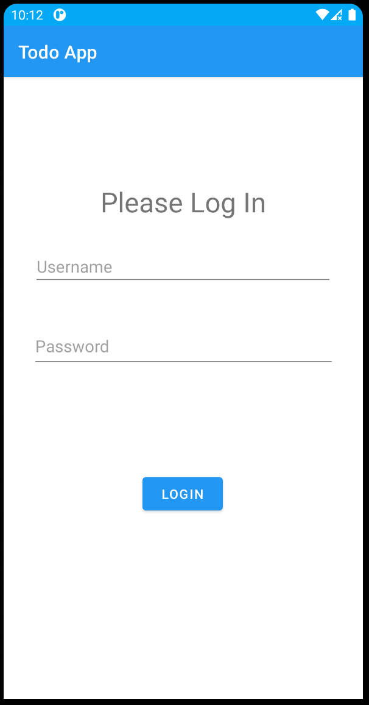</td>	
<td>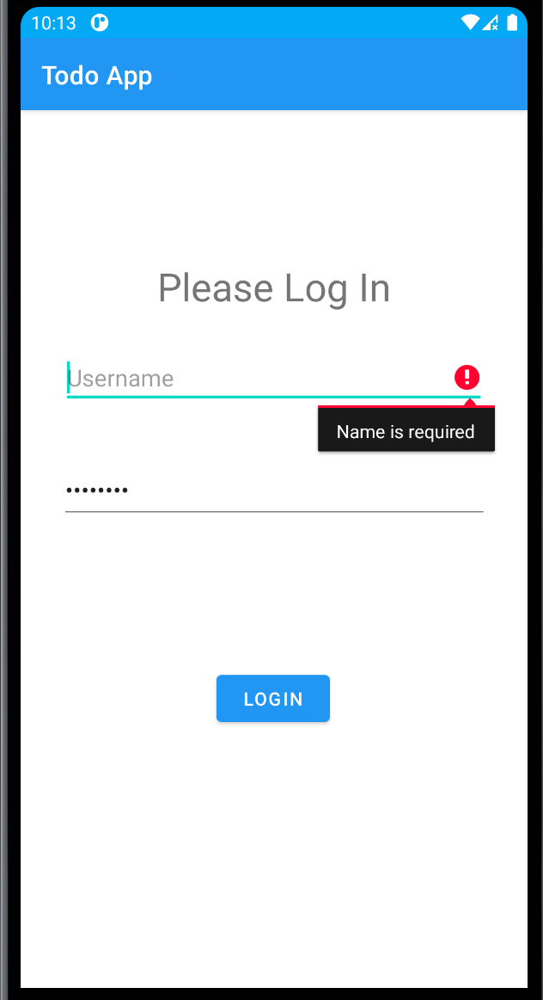</td>
<td>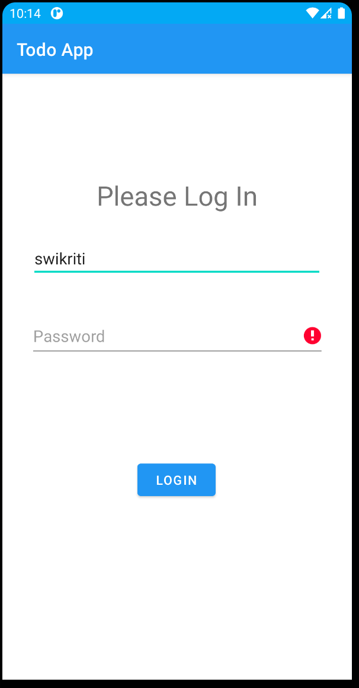</td>
</tr>
</table>

<table>
<tr>
<td>Logged In</td>
</tr>
<tr>
<td></td>
</tr>
</table>

<table>
<tr>
<td>ACTIVITY PAGE</td>
<td>Adding Activity</td>
<td>Details</td>
</tr>
<tr>
<td>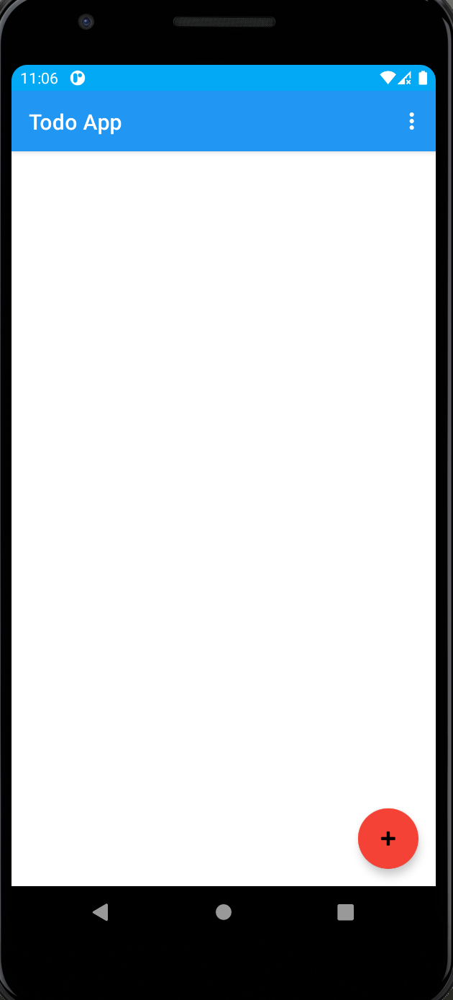 </td>
<td>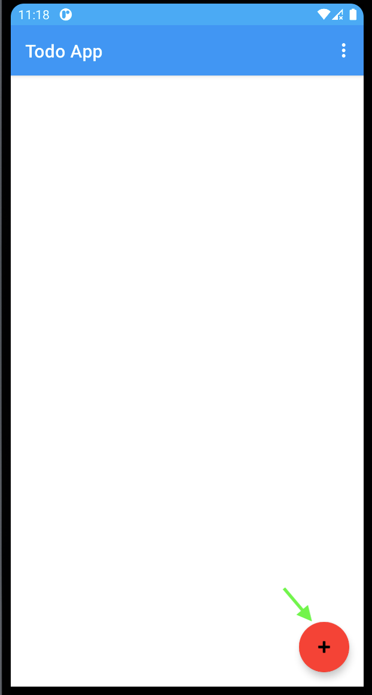 </td>
<td>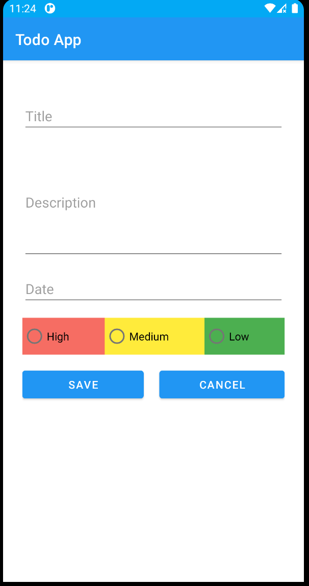 </td>
</tr>
</table>

<table>
<tr>
<td>Adding title </td>
<td>Adding description </td>
<td>Adding date </td>
</tr>
<tr>
<td>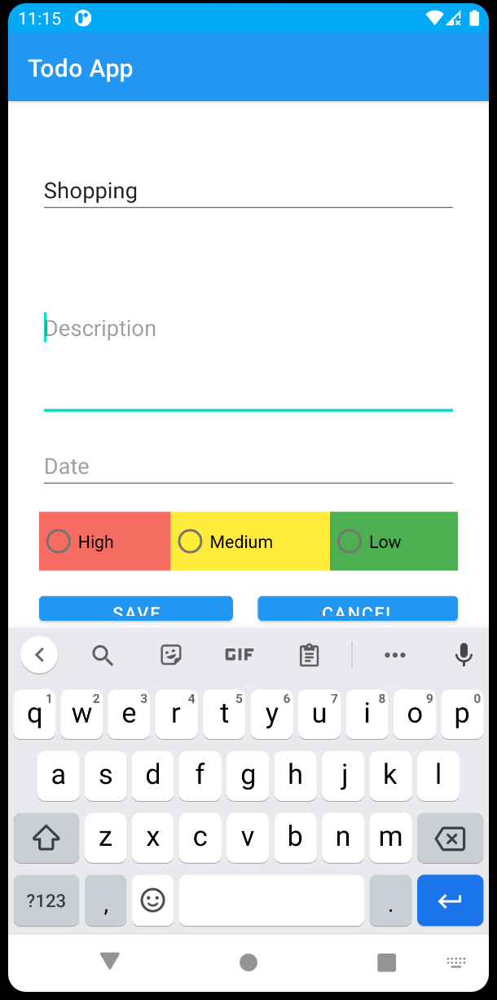 </td>
<td>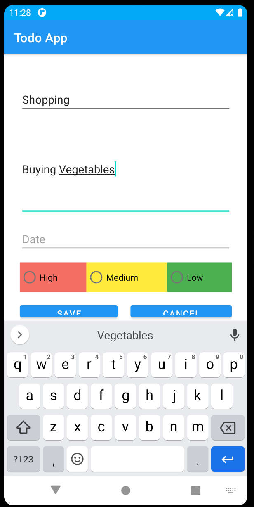 </td>
<td>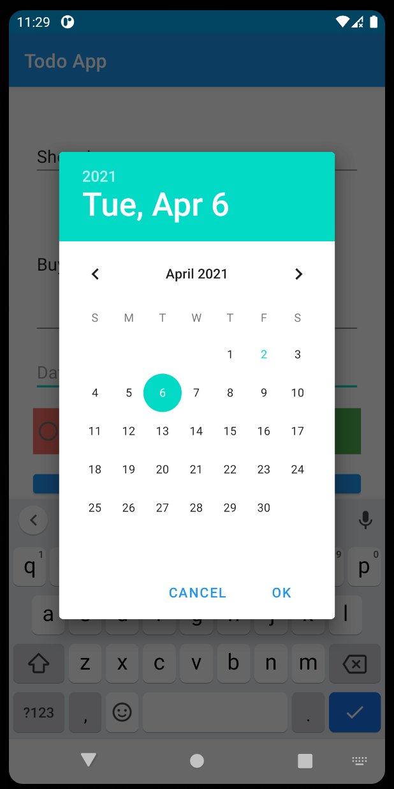 </td>
</tr>
</table>

<table>
<tr>
<td>Adding priority according to the colour</td>
<td>Saving page</td>
<td>Validated saving</td>
</tr>
<tr>
<td>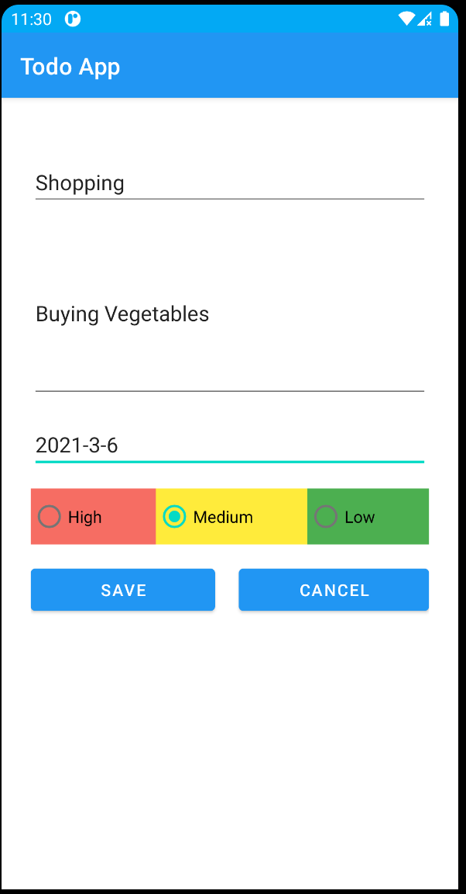 </td>
<td>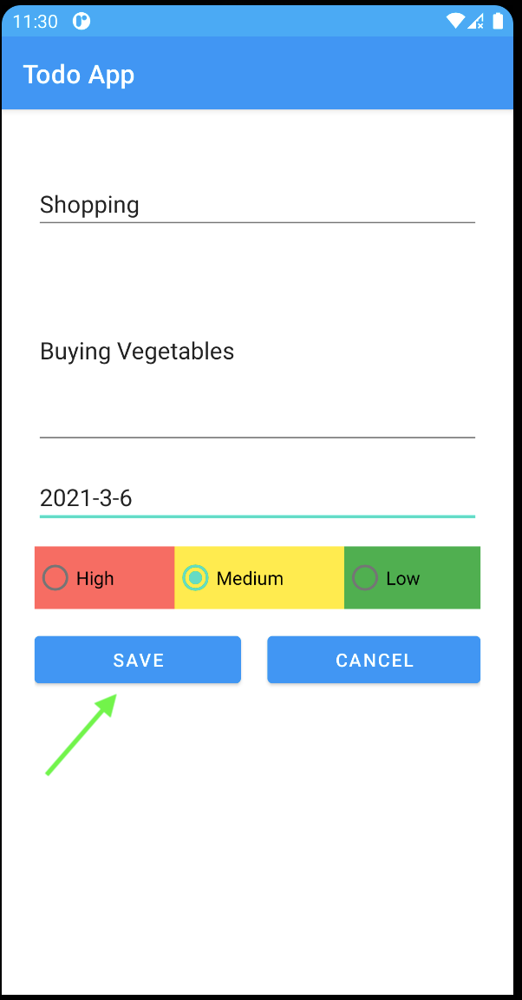 </td>
</tr>
</table>