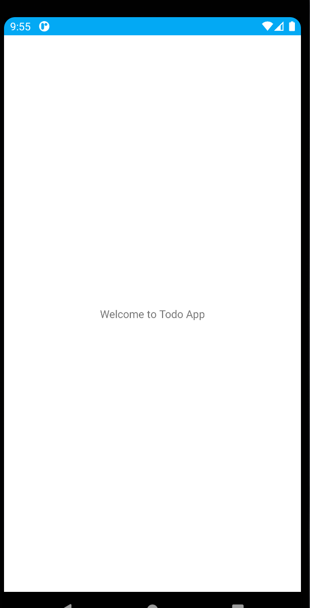

# Todo App
<table>
<tr>
<td>Welcome</td>
</tr>
<tr>
<td></td>
</tr>
</table>

<table>
<tr>
<td>Login</td>
</tr>
<tr>
<td></td>
</tr>
</table>

<table>
<tr>
<td>Login </td>	
<td>Login with validating username</td>
<td>Login with validating pasword</td>
</tr>
<tr>
<td></td>	
<td></td>
<td></td>
</tr>
</table>

